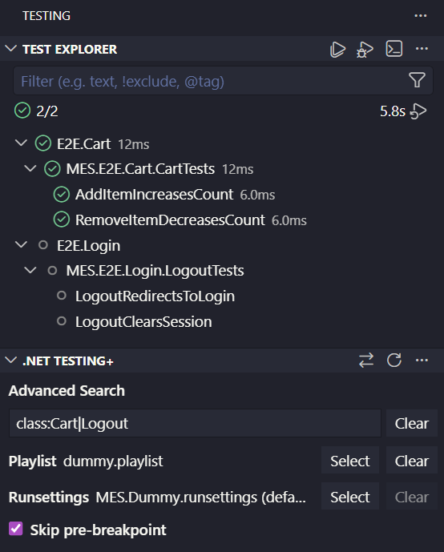

# .NET Testing+

> Filter, run, and debug .NET tests using a Visual Studio .playlist file, advanced filters, and more.

## Overview

Running and debugging tests in VS Code, compared to Visual Studio, is a big downgrade. Many essential features are missing, like filtering tests according to a .playlist file or by a specific class name. This extension aims to fill those gaps.

You can use .NET Testing+ alongside the official C# Dev Kit extension, but they are fully independent.

## Main Features

- Run and debug .NET Solution tests.
- Filter tests according to a playlist file or advanced queries.
- Use custom runsettings files.

## Getting Started

Ensure you have the `dotnet` command available on your machine.

Install the extension through the official VS Code marketplace: https://marketplace.visualstudio.com/items?itemName=RisingFisan.dotnet-testing-plus

## Usage

The extension includes a ".NET Testing+" view. 

**When you first install the extension, it may end up on the "Explorer" tab by default, but it's best to move it to the "Testing" tab.**

This view includes the following options:

- **Select Solution**: this button, in the view's tab, lets you choose the solution file to be used. If the project only has one solution file, it may choose that one by default. Otherwise, you must manually select a file.
- **Advanced Search**: allows you to filter tests by class/project name, using more advanced queries compared to the default VS Code search.
- **Playlist**: select a .playlist file, following the Visual Studio syntax, and filter the tests according to it.
- **Runsettings**: select a custom .runsettings file to run your tests. By default, the .runsettings file in the solution directory is used.
- **Skip pre-breakpoint**: Since this extension is not tightly integrated with VS Code, it uses the `dotnet` command to debug tests. This command creates an initial breakpoint when debugging tests, before the test starts executing. This option, enabled by default, skips that breakpoint.

## Contact

If you find any bugs or issues while using the extension, feel free to leave a comment and/or PR on the .NET Testing+ GitHub page, at https://github.com/RisingFisan/vscode-dotnet-testing-plus.

## License

This project is licensed under the [GNU General Public License v3.0](https://www.gnu.org/licenses/gpl-3.0.html). Commercial use is permitted, but distributed modified versions and other covered works must remain under GPLv3 and include the corresponding source. See [LICENSE](LICENSE) for the complete terms.

**Disclaimer**: Most of the code in this extension was written by generative AI. It was developed as a side project while working at Critical Manufacturing. The code quality may not be up to my usual standards, but it has been reviewed and tested by humans. This page was also 100% human-written.
